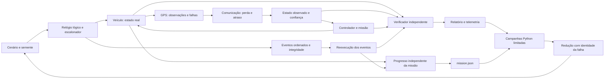

# Autonomous Systems V&V Lab

Laboratório em Rust para verificar missões de um veículo autónomo terrestre em duas dimensões. Combina falhas de GPS e comunicação, distingue segurança de conclusão da missão e reduz cenários com falhas para obter exemplos menores que se reproduzem exatamente.

**Estado: M2, protótipo de verificação e campanhas limitadas.** O problema central é descobrir e explicar falhas: obter a mesma evidência, no mesmo passo lógico, e remover condições desnecessárias sem trocar a falha por outra. Rust executa a simulação e a verificação; Python coordena campanhas e minimização. Não controla equipamento real.

## Executar uma missão

Requisitos: Rust e Cargo na versão indicada em `rust-toolchain.toml`. Python 3.10 ou superior para campanhas e minimização; não exige bibliotecas adicionais.

```sh
cargo run -- run scenarios/basic-mission.json --seed 42 --output runs/basic
cargo run -- replay runs/basic/events.json
cargo test
```

Cada execução grava `events.json`, `report.json` e `mission.json`. A saída de `run` mantém o contrato do M1: `0` quando os invariantes passam, `2` quando há violações e `1` para erros de configuração, integridade ou execução. Uma missão pode ter segurança PASS e ficar incompleta ou estagnada. A conclusão também não apaga uma violação de segurança.

`mission.json` confirma a chegada física aos pontos de passagem por ordem e apresenta o resultado `completed`, `incomplete`, `stalled` ou `invalid_terminated`. Inclui progresso, tempo em paragem de segurança e motivo da classificação. O controlador usa apenas observações; esta confirmação pertence à análise independente.

## Injetar e reproduzir falhas

```sh
cargo run -- run scenarios/gps-dropout.json --seed 42 --output runs/gps
cargo run -- run scenarios/communication-fault.json --seed 42 --output runs/communication
cargo run -- run scenarios/restricted-zone-failure.json --seed 42 --output runs/failure
cargo run -- replay runs/failure/events.json
```

O terceiro comando termina com código `2`: a trajetória entra na zona restrita. A reprodução termina com código `0` se reconstruir exatamente essa execução, incluindo as violações. Consultar `report.json` para o identificador do invariante, passo, estado real e observado, causa e condição esperada e observada.

`safe-fallback-failure.json` e `invalid-transition.json` ativam alterações deliberadas do controlador, identificadas em `validation_mutants`, para provar que o verificador deteta a falta de entrada no estado de segurança `fallback` e uma transição inválida. São cenários de validação do verificador.

Primeira violação da zona restrita, com campos selecionados do relatório da semente 42:

```json
{
  "name": "restricted_zone",
  "passed": false,
  "failures": [{
    "tick": 4,
    "truth_position": { "x_mm": 3000, "y_mm": 4250 },
    "trigger_event_sequence": 29,
    "trigger_event_kind": "tick_result",
    "expected": "truth position and swept segment outside restricted polygon",
    "observed_result": "from=(2500,4250); to=(3000,4250)"
  }]
}
```

## Arquitetura



Um pacote Rust mantém as fronteiras entre simulação, veículo, sensores, falhas, missão, verificação, reprodução e interface de linha de comandos. O controlador decide a partir das observações e não lê a posição real. O motor usa-a para mover o veículo e gerar amostras; o verificador usa-a para avaliar os invariantes.

Os três invariantes principais verificam:

- **`restricted_zone`**: nem a posição inicial nem o segmento percorrido podem tocar ou entrar no polígono restrito.
- **`safe_fallback`**: confiança abaixo do limiar durante o intervalo configurado exige o estado de segurança de paragem.
- **`valid_state_transitions`**: cada mudança de missão e segurança tem de respeitar o respetivo grafo.

Os limites do ambiente são explícitos e também são verificados. [Contrato do modelo e da reprodução](docs/architecture.md).

Baixa confiança impede movimento logo no primeiro passo. O monitor confirma também que uma ordem de paragem corresponde a ausência de deslocamento real. A verificação das transições compara o grafo, a cadeia de eventos e os estados anteriores e atuais.

## Determinismo e integridade

Há dois modos distintos:

1. **Nova execução pela semente:** cenário e semente iguais produzem JSON canónico e somas de controlo iguais.
2. **Reprodução dos eventos:** carrega o cenário e a sequência de entradas, reconstrói a simulação e compara os estados, as transições, a telemetria e os invariantes com o manifesto original.

A reprodução confirma também que as entradas registadas correspondem à semente. Por isso, depende da mesma versão do gerador pseudoaleatório e das regras do modelo.

Coordenadas inteiras, passos fixos, algoritmo pseudoaleatório explícito e ordem total dos eventos evitam dependências de tempo real e diferenças de arredondamento. Os hashes SHA-256 detetam alterações no cenário e no registo. Não são assinaturas: quem substituir deliberadamente todo o artefacto e recalcular os hashes pode criar um novo registo válido. A confiança na origem exige guardar a soma de controlo numa fonte independente.

O formato tem versão e rejeita campos desconhecidos e valores fora dos limites. A compatibilidade entre versões do simulador exige testes; a versão do formato não garante por si só o mesmo comportamento futuro.

## Campanha e verificações

```sh
cargo fmt --check
cargo clippy --all-targets -- -D warnings
cargo test
cargo build --release
python -m unittest discover -s tests -p "test_*.py"
python scripts/run_campaign.py --seeds 42,1337,2026 --output-root runs/campaign
```

A campanha predefinida executa 87 casos, incluindo regressões M1 e variantes `standard`, `short-stall` e `fault-stress` do M2. Grava JSON, resumo Markdown e evidência por cenário, variante e semente. Separa violações esperadas de regressões, verifica a repetição canónica e reproduz cada caso. As métricas de progresso incluem destinos atingidos, intervalo sem progresso e tempo em `fallback`.

`--suite m2 --seeds 42 --variants standard` seleciona dez casos. `--max-cases`, `--max-runs`, `--max-artifact-bytes` e `--time-budget-seconds` limitam a campanha antes e durante a execução. `--max-runs` conta invocações do simulador, incluindo repetições, reprodução e análise. Uma expectativa satisfeita não transforma uma missão insegura numa missão bem-sucedida.

GitHub Actions executa formatação, Clippy, testes Rust e Python, cobertura mínima de 80%, campanha combinada, minimização e reprodução em Linux e Windows. Compara os hashes canónicos entre os dois sistemas, incluindo o cenário reduzido. [Resultados do M2](docs/m2-results.md), [resultados do M1](docs/m1-results.md) e [contrato de reprodução](docs/reproducibility.md).

## Reduzir uma falha

O par `f-zone-nominal.json` e `g-zone-fault.json` mantém missão, geometria e limiar de confiança. O primeiro conclui com segurança PASS. Com ruído de GPS, o segundo toca na zona restrita. Não utiliza `validation_mutants`.

```sh
cargo build --release
cargo run -- run scenarios/m2/g-zone-fault.json --seed 42 --output runs/original
python scripts/minimize_failure.py scenarios/m2/g-zone-fault.json --seed 42 --output runs/minimized --max-candidates 80 --time-budget-seconds 30
cargo run -- run runs/minimized/scenarios/minimized.json --seed 42 --output runs/reduced
cargo run -- replay runs/original/events.json
cargo run -- replay runs/reduced/events.json
```

Os dois comandos `run` terminam com código 2, por violação esperada. Executar os comandos seguintes mesmo após esse código. O script localiza o executável em `target/release`; `--binary` ou `VV_LAB_BINARY` permitem indicar outro caminho.

Na semente 42, a redução verificada diminui o horizonte de 32 para 19 passos e o ruído máximo de 500 para 3 mm. Conserva `restricted_zone`, a transição real do exterior para a fronteira e uma observação com ruído que influencia o movimento. O cenário reduzido reproduz exatamente a sua própria execução; não tem de gerar a mesma trajetória ou o mesmo hash do original.

`runs/minimized/summary.json` e `summary.md` apresentam assinaturas antes e depois, reduções aceites, candidatos rejeitados, limites e comandos concretos. As pastas `original/` e `final/` contêm eventos e relatórios já reproduzidos. Por omissão, a pesquisa conserva a semente e limita-se a 80 candidatos, 30 segundos, 16 MiB retidos e 32 MiB temporários. Se nenhum candidato válido conservar a falha, apresenta esse resultado.

Também é possível selecionar `--property mission:stalled` para reduzir uma estagnação. A pesquisa mantém a classificação, os critérios de progresso e a política. É uma redução prática limitada, sem garantia de mínimo global. [Exemplo com evidência e métricas](docs/m2-results.md) e [catálogo de cenários](docs/scenario-catalogue.md).

## Simplificações deliberadas

- Movimento cinemático numa grelha 2D, com orientação cardinal e velocidade discreta. Sem aceleração, dinâmica dos pneus, colisões entre veículos ou física de terreno.
- Pontos de passagem e controlador simples. Não existe planeamento de trajetórias para evitar a zona restrita; o verificador deteta uma trajetória insegura.
- Confiança do GPS e envelhecimento das observações seguem regras explícitas do modelo. Não representam um estimador probabilístico calibrado.
- As mensagens transportam observações do GPS. Não há protocolo de rede real, múltiplos agentes ou controlo de equipamento.
- A integridade do registo não prova a segurança de um sistema real. O laboratório verifica propriedades deste modelo e das entradas fornecidas.
- Sem interface gráfica, serviços distribuídos ou alojamento. A pesquisa tem uma ordem determinística, mas um orçamento de tempo atingido pode interrompê-la mais cedo numa máquina lenta.
- As regras de identidade da falha são conservadoras e específicas deste modelo. O próximo marco pode acrescentar perturbações do atuador e contratos temporais, com novos contraexemplos reproduzíveis.
