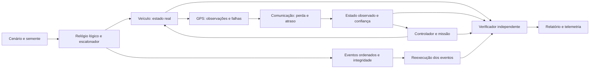

# Autonomous Systems V&V Lab

Laboratório em Rust para verificar missões de um veículo autónomo terrestre em duas dimensões. Executa uma missão, injeta falhas de GPS e comunicação, deteta violações de segurança e reproduz os mesmos estados e resultados a partir de eventos registados.

**Estado: M1, protótipo executável para revisão.** O problema central é a reprodução de falhas: obter a mesma evidência, no mesmo passo da simulação, sem depender do relógio do computador. Não controla equipamento real.

## Executar uma missão

Requisitos: Rust e Cargo na versão indicada em `rust-toolchain.toml`. Python 3.10 ou superior apenas para a campanha; não exige bibliotecas adicionais.

```sh
cargo run -- run scenarios/basic-mission.json --seed 42 --output runs/basic
cargo run -- replay runs/basic/events.json
cargo test
```

Cada execução grava `events.json` e `report.json`. A saída de `run` é `0` quando os invariantes passam, `2` quando há violações e `1` para erros de configuração, integridade ou execução. Uma missão pode terminar o horizonte de simulação sem concluir todos os pontos de passagem; PASS refere-se aos invariantes avaliados.

## Injetar e reproduzir falhas

```sh
cargo run -- run scenarios/gps-dropout.json --seed 42 --output runs/gps
cargo run -- run scenarios/communication-fault.json --seed 42 --output runs/communication
cargo run -- run scenarios/restricted-zone-failure.json --seed 42 --output runs/failure
cargo run -- replay runs/failure/events.json
```

O terceiro comando termina com código `2`: a trajetória entra na zona restrita. A reprodução termina com código `0` se reconstruir exatamente essa execução, incluindo as violações. Consultar `report.json` para o identificador do invariante, passo, estado real e observado, causa e condição esperada e observada.

`safe-fallback-failure.json` e `invalid-transition.json` ativam alterações deliberadas do controlador, identificadas em `validation_mutants`, para provar que o verificador deteta a falta de entrada no estado de segurança `fallback` e uma transição inválida. São cenários de validação do verificador.

Primeira violação da zona restrita, com campos selecionados do relatório da semente 42:

```json
{
  "name": "restricted_zone",
  "passed": false,
  "failures": [{
    "tick": 4,
    "truth_position": { "x_mm": 3000, "y_mm": 4250 },
    "trigger_event_sequence": 29,
    "trigger_event_kind": "tick_result",
    "expected": "truth position and swept segment outside restricted polygon",
    "observed_result": "from=(2500,4250); to=(3000,4250)"
  }]
}
```

## Arquitetura



Um pacote Rust mantém as fronteiras entre simulação, veículo, sensores, falhas, missão, verificação, reprodução e interface de linha de comandos. O controlador decide a partir das observações e não lê a posição real. O motor usa-a para mover o veículo e gerar amostras; o verificador usa-a para avaliar os invariantes.

Os três invariantes principais verificam:

- **`restricted_zone`**: nem a posição inicial nem o segmento percorrido podem tocar ou entrar no polígono restrito.
- **`safe_fallback`**: confiança abaixo do limiar durante o intervalo configurado exige o estado de segurança de paragem.
- **`valid_state_transitions`**: cada mudança de missão e segurança tem de respeitar o respetivo grafo.

Os limites do ambiente são explícitos e também são verificados. [Contrato do modelo e da reprodução](docs/architecture.md).

Baixa confiança impede movimento logo no primeiro passo. O monitor confirma também que uma ordem de paragem corresponde a ausência de deslocamento real. A verificação das transições compara o grafo, a cadeia de eventos e os estados anteriores e atuais.

## Determinismo e integridade

Há dois modos distintos:

1. **Nova execução pela semente:** cenário e semente iguais produzem JSON canónico e somas de controlo iguais.
2. **Reprodução dos eventos:** carrega o cenário e a sequência de entradas, reconstrói a simulação e compara os estados, as transições, a telemetria e os invariantes com o manifesto original.

A reprodução confirma também que as entradas registadas correspondem à semente. Por isso, depende da mesma versão do gerador pseudoaleatório e das regras do modelo.

Coordenadas inteiras, passos fixos, algoritmo pseudoaleatório explícito e ordem total dos eventos evitam dependências de tempo real e diferenças de arredondamento. Os hashes SHA-256 detetam alterações no cenário e no registo. Não são assinaturas: quem substituir deliberadamente todo o artefacto e recalcular os hashes pode criar um novo registo válido. A confiança na origem exige guardar a soma de controlo numa fonte independente.

O formato tem versão e rejeita campos desconhecidos e valores fora dos limites. A compatibilidade entre versões do simulador exige testes; a versão do formato não garante por si só o mesmo comportamento futuro.

## Campanha e verificações

```sh
cargo fmt --check
cargo clippy --all-targets -- -D warnings
cargo test
cargo build --release
python scripts/run_campaign.py --seeds 42,1337,2026 --output-root runs/campaign
```

A campanha usa uma lista limitada de cenários e sementes. Resume execuções, invariantes falhados, sementes de reprodução, tempo real total e caminhos da evidência. Os cenários de violação deliberada têm resultados esperados próprios. Os testes do produto e as verificações da integração contínua têm de passar.

GitHub Actions executa formatação, análise estática, testes, campanha e reprodução determinística em Linux e Windows. [Resultados e medição do M1](docs/m1-results.md).

## Simplificações deliberadas

- Movimento cinemático numa grelha 2D, com orientação cardinal e velocidade discreta. Sem aceleração, dinâmica dos pneus, colisões entre veículos ou física de terreno.
- Pontos de passagem e controlador simples. Não existe planeamento de trajetórias para evitar a zona restrita; o verificador deteta uma trajetória insegura.
- Confiança do GPS e envelhecimento das observações seguem regras explícitas do modelo. Não representam um estimador probabilístico calibrado.
- As mensagens transportam observações do GPS. Não há protocolo de rede real, múltiplos agentes ou controlo de equipamento.
- A integridade do registo não prova a segurança de um sistema real. O laboratório verifica propriedades deste modelo e das entradas fornecidas.
- Sem interface gráfica, serviços distribuídos ou alojamento. O próximo passo é ampliar campanhas e propriedades apenas depois de estabilizar o contrato de reprodução.
