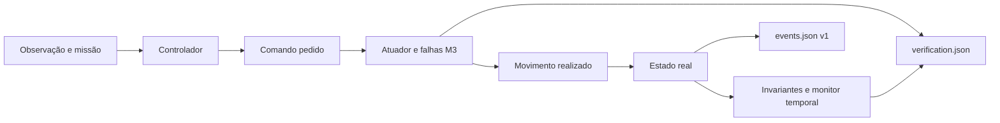

# Contrato do modelo e da reprodução

## Fronteiras do sistema

O modelo do veículo guarda posição real, orientação e movimento. O sensor gera observações a partir desse estado e da entrada de falhas. A comunicação entrega, atrasa ou perde essas observações. O controlador toma decisões a partir do estado observado e dos pontos de passagem da missão, sem ler a posição real.

O verificador observa o estado real, o estado observado e as transições. Não altera as decisões do controlador. Esta separação permite detetar tanto trajetórias inseguras como decisões baseadas em localização insuficiente. No M2, o controlador recebe um contexto tipado limitado a observações, estado da missão e segurança, destino e configuração autorizada. O estado físico pertence ao motor; não faz parte dessa interface.

`ControllerInput` não contém posição real. `ControllerState` guarda apenas missão, segurança, índice do destino e sequência de recuperação. As atualizações devolvem intenções de transição; o motor regista-as na mesma ordem do M1. O controlador também não recebe o registo de eventos nem a telemetria do verificador, que transportam estado real. Um teste de compilação rejeita a leitura de uma posição real através da interface.

## Tempo e números

Cada iteração corresponde a um passo fixo. O número do passo é a fonte de tempo da simulação; o tempo lógico é o produto desse número pela duração configurada. A execução não espera pela passagem de tempo real.

| Campo | Valor por omissão | Significado |
| --- | --- | --- |
| `tick_ms` | 100 | Duração lógica de cada passo, em milissegundos |
| `safety.confidence_threshold_permille` | 500 | Confiança mínima, numa escala de 0 a 1 000 |
| `safety.fallback_after_ticks` | 3 | Passos consecutivos abaixo do limiar até entrar em paragem de segurança |
| `safety.recovery_after_ticks` | 2 | Passos consecutivos com confiança suficiente até retomar |

As janelas de falhas incluem os dois extremos: `start_tick` e `end_tick`. Os passos da execução vão de 1 até `steps`, inclusive.

As posições usam milímetros inteiros. A orientação admite quatro direções. O deslocamento por passo é explícito. A chegada a um ponto de passagem usa distância de Manhattan, `|dx| + |dy|`, em vez de distância euclidiana. Um passo inteiro pode ultrapassar um ponto; ajustar o raio de chegada ao passo e à grelha da missão. Não há garantia de convergência para qualquer configuração.

A ordem de atualização faz parte do contrato: entradas, entrega de observações, confiança, decisão, movimento e verificação têm uma sequência definida.

O cenário impõe limites de dimensão, duração, vértices e severidade das falhas. A geometria usa operações inteiras com capacidade suficiente para os limites aceites. O polígono tem de ser simples e ter área positiva; os seus vértices podem ser fornecidos em qualquer dos dois sentidos. A última aresta liga implicitamente o último vértice ao primeiro, sem repetir o vértice inicial na lista.

Tocar na fronteira da zona restrita conta como violação. Verificar o segmento percorrido entre estados evita que um veículo atravesse uma zona estreita sem produzir um ponto de telemetria no interior.

## Missão e segurança

Os estados de missão e segurança são distintos. A missão começa pendente, passa a execução e pode concluir. A segurança pode passar de nominal a paragem de segurança e regressar após recuperação da confiança. A paragem suspende o movimento, mas não apaga a missão.

As observações transportam a posição estimada, instante de amostragem e confiança. Uma observação antiga não se torna recente quando a comunicação a entrega. Mensagens com amostragem anterior à última observação aceite não podem substituir uma localização mais recente.

A confiança base é `1000 - floor(1000 * (|ruído_x| + |ruído_y|) / (2 * noise_max_mm))`; sem ruído, é 1 000. Depois, a confiança efetiva diminui linearmente com a idade: `floor(base * (idade_máxima + 1 - idade) / (idade_máxima + 1))`, até zero para uma amostra expirada. São regras de um sensor simulado, não estimativas calibradas de erro real.

A condição de entrada em segurança usa uma sequência contínua de passos com confiança abaixo do limiar. O verificador mede essa condição independentemente do estado interno do controlador. Os cenários com `validation_mutants` permitem contrariar deliberadamente o controlador e testar a deteção.

| Subsistema | Arestas permitidas |
| --- | --- |
| Missão | `pending` para `running`; `running` para `completed` |
| Segurança | `nominal` para `fallback`; `fallback` para `nominal` |

Manter o mesmo estado não emite uma transição. `completed` é terminal. A falta de uma observação utilizável impede movimento, mesmo antes de o contador atingir o intervalo que exige a transição para `fallback`.

## Progresso e conclusão no M2

O estado de missão do controlador conserva o contrato do M1: reconhece destinos a partir de observações suficientemente confiantes. A análise independente confirma os destinos pela posição real, na ordem configurada, usando o mesmo raio de Manhattan. Examina a posição inicial e as posições antes e depois de cada movimento. Atravessar o raio entre duas posições amostradas não conta como chegada.

`completed` exige que o controlador anuncie conclusão e que todos os destinos tenham sido fisicamente atingidos até esse passo. Se o controlador concluir sem essa confirmação, o resultado é `invalid_terminated`, com motivo `observation_completion_not_confirmed`. A análise não corrige o controlador nem altera os eventos.

Progresso significativo significa atingir um destino ou diminuir a melhor distância ao próximo destino pelo menos `min_progress_mm`, por omissão 1 mm. A distância tem uma referência por destino; pequenas melhorias acumulam-se até ao limiar. Oscilar em posições já visitadas não reinicia indefinidamente o contador.

O resultado é `stalled` se, no fim do horizonte, ainda houver destinos por atingir e o intervalo sem progresso atingir `stall_window_ticks`, por omissão oito passos. Um horizonte mais curto ou uma missão ainda com progresso dá `incomplete`. Se todos os destinos físicos já tiverem sido atingidos, mas o controlador ainda não confirmar a conclusão, o resultado também é `incomplete`; os dois contadores de destinos explicam essa diferença. `stall_detected_tick` conserva a primeira deteção, mesmo que a missão retome e depois conclua.

O motivo `expected_fault_hold` exige que todos os passos da janela final sejam paragens por baixa confiança ou pelo estado `fallback`. Caso contrário, o motivo é `unexpected_no_progress`. Esta distinção descreve a condição observada; não prova que toda a perda de progresso tenha uma única causa. Os contadores de baixa confiança e de `fallback` podem sobrepor-se.

A política de progresso fica em `mission.json`, separada do cenário v1. O resultado conserva `safety_status`, mas não o substitui: uma missão concluída pode ter invariantes falhados, e uma missão estagnada pode ter segurança PASS.

## Falhas e ordem

GPS e comunicação têm configuração independente. O GPS pode perder amostras por janela explícita ou probabilidade por passo e pode acrescentar ruído inteiro limitado. A comunicação pode perder pacotes e aplicar atraso em passos lógicos.

Os sorteios usam um gerador pseudoaleatório com semente explícita. A ordem e o número de sorteios fazem parte do comportamento do formato. Os eventos recebidos no mesmo passo têm desempate estável pelo número de sequência.

O gerador é XorShift64*, com estado de 64 bits e multiplicação com retorno modular explícito. A semente zero usa o estado inicial `0x9e3779b97f4a7c15`. Os testes fixam uma sequência de referência. Este gerador serve a repetibilidade da simulação, não aplicações criptográficas.

## Artefactos

`events.json` contém cenário, semente, parâmetros, entradas ordenadas, hashes e resultados necessários à comparação. `report.json` contém o relatório legível por ferramentas, com transições, telemetria e evidência dos invariantes.

O M2 acrescenta `mission.json`, com versão própria e referência ao hash final da sequência de eventos. Este relatório distingue conclusão, horizonte insuficiente, estagnação e terminação inválida. Não altera o formato v1 de `events.json` nem de `report.json`, a sequência pseudoaleatória ou os hashes fixados do M1. A análise de um registo exige primeiro a sua reprodução e recalcula o progresso a partir da trajetória reconstruída.

A serialização canónica usa JSON compacto com campos estruturados numa ordem fixa. Não inclui caminhos de saída, carimbos de tempo real ou medições de desempenho. As medições da campanha ficam fora dos resultados canónicos.

A reprodução valida a versão, os limites, a sequência, a integridade e o contrato dos eventos. Reaplica as entradas à simulação e recalcula os resultados. Confirma também que cada entrada coincide com a sequência gerada pela semente, pelo que depende da mesma versão do gerador. Compara o resultado completo, não apenas o estado final. Uma execução que falhou um invariante pode ser reproduzida corretamente.

SHA-256 protege contra alterações acidentais e permite comparar artefactos. Não autentica autoria. Para preservar proveniência contra substituição maliciosa, guardar o hash esperado fora do próprio ficheiro ou usar uma assinatura num marco posterior.

## Campanhas e redução no M2

Python invoca o executável Rust; não implementa outra simulação. O manifesto M2 fixa os cenários, hashes, sementes, variantes e expectativas explícitas. Uma variante pode mudar parâmetros de falhas ou a política de progresso dentro dos limites permitidos. A campanha executa cada caso duas vezes, compara os três artefactos, reproduz os eventos e reconstrói a análise de missão. Conserva resultados inseguros como tal, mesmo quando são demonstrações esperadas.

Os módulos Python separam planeamento da matriz, execução limitada, metadados M2 e relatórios. A contabilidade de artefactos acompanha cada pasta de caso e confirma o total no fim. Há limites de casos, invocações, tempo, saída dos processos e bytes retidos. As medições de duração e os nomes das pastas não pertencem aos hashes canónicos.

O minimizador percorre, por ordem fixa, remoção e encurtamento de janelas, diminuição de severidade e horizonte. Mantém missão, veículo, geometria, política de segurança, alterações deliberadas e semente. Cada candidato tem de ser aceite pelo validador Rust, reproduzir exatamente os seus eventos e regenerar a sua análise. Só aceita uma diminuição da métrica de complexidade que conserve a identidade da falha.

Para invariantes, a assinatura conserva o conjunto de invariantes falhados, a condição esperada, o tipo de evento, a primeira condição de falha, a relação geométrica e as classes de perturbação relevantes. Para progresso, conserva resultado, motivo, política e critérios de destinos e paragem. Não basta qualquer código de erro ou outra violação. A redução de horizonte fica desativada para `mission:incomplete`, pois o horizonte define essa classificação.

A métrica de pesquisa soma passos, número e duração de janelas e severidade dos parâmetros com pesos explícitos em `complexity_metrics`. É uma ordenação da pesquisa, sem interpretação física ou promessa de mínimo global. Os limites são aplicados a candidatos, prazo, saída retida e espaço temporário; atingir um limite produz um estado explícito. Um orçamento de tempo pode interromper a mesma ordem de pesquisa em pontos diferentes consoante a máquina.

## Contratos temporais e atuadores no M3

O M3 acrescenta contratos JSON de versão 1. O esquema aceita apenas operadores e predicados tipados: `always`, `never`, `bounded_response`, `ordered_transition` e `bounded_progress`. Rejeita campos desconhecidos, identificadores repetidos, referências sem tipo correspondente e sequências de transição descontínuas. Não interpreta expressões ou código fornecido pelo utilizador.

O monitor Rust percorre um traço finito, com passos contíguos a partir de 1. Um prazo de `N` passos inclui o instante de ativação e termina em `passo_de_ativação + N`; por isso, `N = 0` só aceita uma resposta no próprio passo. Se um predicado de ativação permanecer verdadeiro, o esquema cria uma obrigação quando a duração declarada é atingida e só cria outra depois de a condição passar a falsa ou desconhecida e voltar a qualificar-se. Os comandos de movimento são obrigações independentes, correlacionadas pelo número de sequência do evento de origem.

Uma resposta observada no instante de ativação satisfaz a obrigação. A ordem das mudanças de estado segue a sequência dos eventos de origem. A monitorização de progresso compara o aumento acumulado de progresso significativo medido pela trajetória real. Uma observação GPS ausente que o simulador registou é evidência positiva de `localization_unreliable`. Se a própria telemetria do traço estiver ausente e não houver esse facto, o predicado dependente da localização é desconhecido. A monitorização conserva falhas já demonstradas; uma obrigação pendente no fim do traço é `INCONCLUSIVE`, tal como uma missão que termina antes de um prazo ainda aberto. `PASS` significa apenas que a propriedade se verificou no intervalo finito fornecido, não que qualquer execução futura esteja garantida.

Os contratos de comando distinguem uma resolução observada pelo atuador da aplicação física. `command_resolved` só aceita uma resolução observada no atuador. Uma falha explícita pode satisfazer este contrato de resolução, mas não o contrato `command_applied`. Se o prazo expirar sem resposta do atuador, o contrato falha e o sidecar regista `Timeout` como classificação derivada pelo monitor, não como evento físico. Uma aplicação atrasada continua registada quando ocorre e não apaga a falha de um contrato que já expirou.

As transições ordenadas da versão 1 só aceitam os domínios `mission` e `safety`, cujas mudanças são registadas como eventos de origem. As falhas do atuador têm uma sequência própria de eventos e resultados; ainda não formam um domínio de transições ordenadas.

O controlador continua a receber apenas observações e configuração da missão. A saída pedida passa pelo modelo do atuador antes de alterar o estado real:

Uma configuração sem falhas preserva a ação do M2. As falhas declarativas incluem perda de movimento, atraso determinístico e continuação do último movimento depois de um pedido de paragem. A semente própria do atuador é combinada com a semente da missão, num fluxo pseudoaleatório separado do gerador dos sensores. As janelas usam passos inclusivos; comandos atrasados podem executar depois da janela e sobrepor-se a uma paragem posterior, segundo a ordem documentada no módulo.

O artefacto novo `verification.json` guarda a configuração do atuador, os contratos usados, os resultados do monitor, as evidências e as referências aos eventos de origem. O formato legado `events.json` e `report.json` mantém-se v1. A reprodução M3 valida ambos os artefactos, executa novamente a simulação e o monitor e compara as evidências. Python escolhe cenários e organiza campanhas limitadas; não calcula o resultado autoritativo dos contratos.

## Evolução do contrato

Alterações na ordem de eventos, arredondamentos, gerador, confiança, grafo ou serialização podem mudar o comportamento. Exigem cenários de regressão e decisão explícita sobre a versão do contrato. Separar serviços ou introduzir um protocolo só se houver uma necessidade real de interface.
